# Riffle

An Android ebook reader and audiobook player for [Audiobookshelf](https://www.audiobookshelf.org/) and [Storyteller](https://storyteller-platform.gitlab.io/storyteller) self-hosted servers.

[](https://ko-fi.com/pkmetski)

Riffle lets you browse your library, read EPUB and PDF files, listen to audiobooks, and keep reading and listening progress in sync across devices — all from a clean, privacy-respecting Android app.

## Screenshots

<table>
  <tr>
    <td align="center" width="33%">
      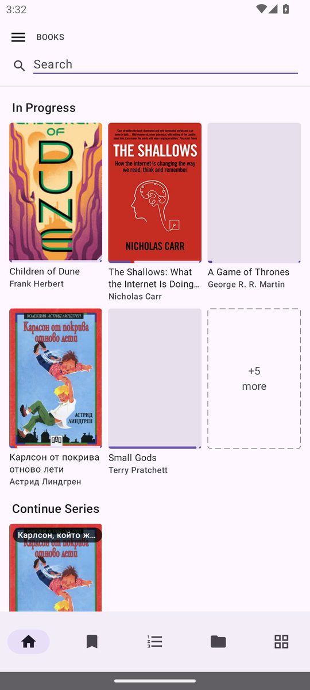<br>
      <sub><b>Library</b> — cover grid with book details</sub>
    </td>
    <td align="center" width="33%">
      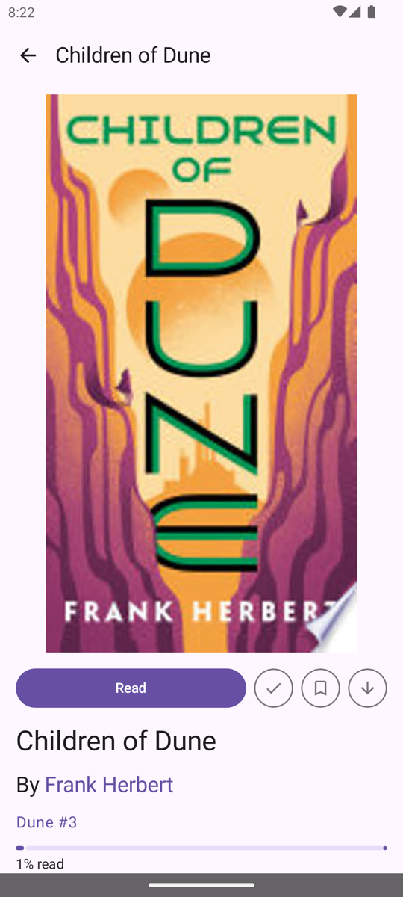<br>
      <sub><b>Book detail</b> — read, listen, series &amp; progress</sub>
    </td>
    <td align="center" width="33%">
      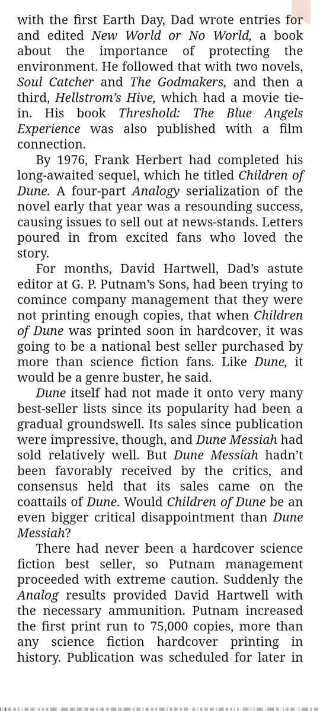<br>
      <sub><b>Reader</b> — clean, immersive reading</sub>
    </td>
  </tr>
  <tr>
    <td align="center" width="33%">
      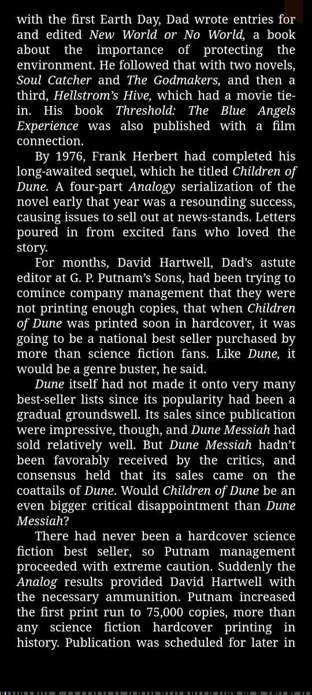<br>
      <sub><b>Themes</b> — light, dark, dim &amp; sepia</sub>
    </td>
    <td align="center" width="33%">
      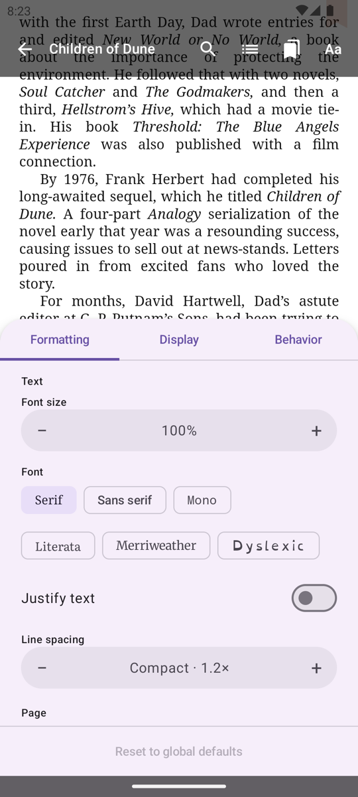<br>
      <sub><b>Formatting</b> — fonts, sizing &amp; spacing</sub>
    </td>
    <td align="center" width="33%">
      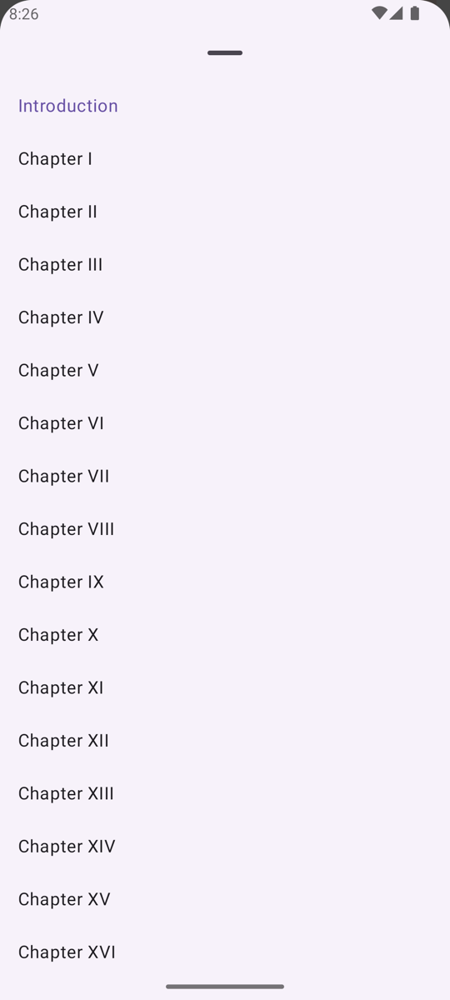<br>
      <sub><b>Navigation</b> — table of contents</sub>
    </td>
  </tr>
  <tr>
    <td align="center" width="33%">
      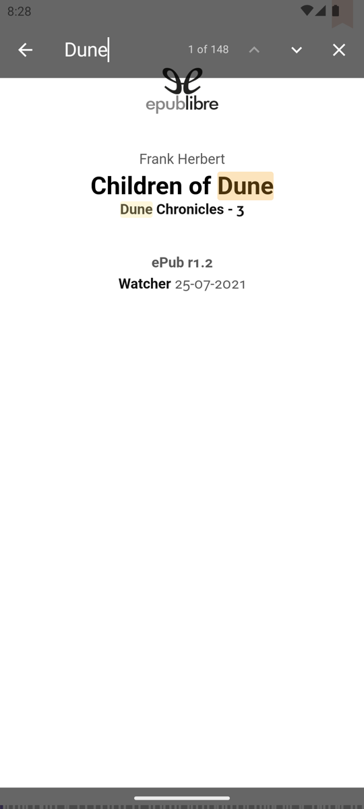<br>
      <sub><b>Search</b> — full-text in-book search</sub>
    </td>
    <td align="center" width="33%">
      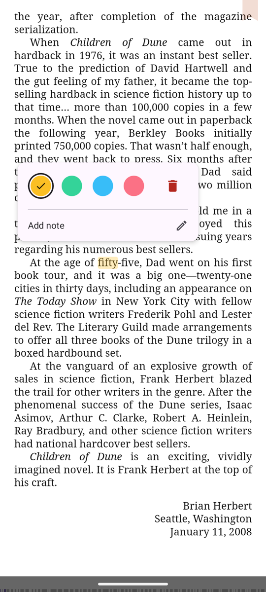<br>
      <sub><b>Highlights</b> — colors &amp; attached notes</sub>
    </td>
    <td align="center" width="33%">
      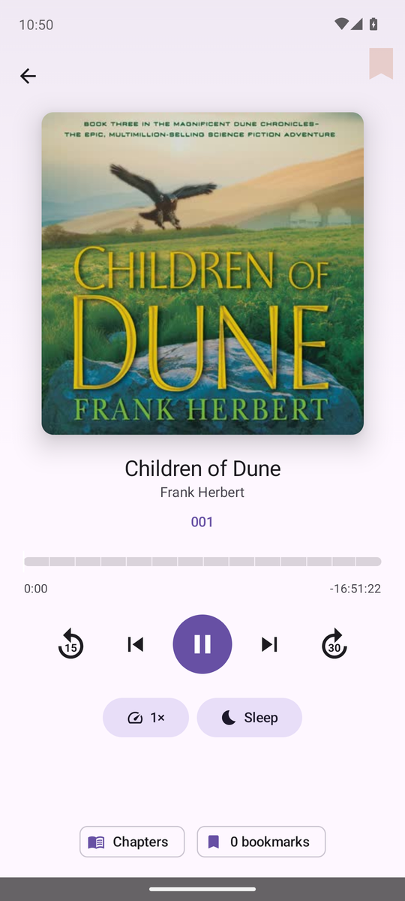<br>
      <sub><b>Listening</b> — full audiobook player</sub>
    </td>
  </tr>
  <tr>
    <td align="center" width="33%">
      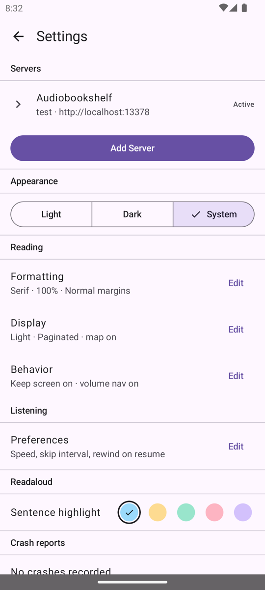<br>
      <sub><b>Server &amp; sync</b> — multi-server settings</sub>
    </td>
    <td align="center" width="33%">
      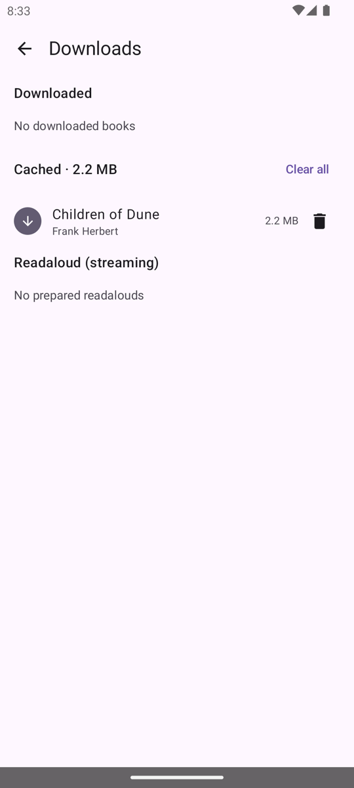<br>
      <sub><b>Offline</b> — downloads &amp; cache manager</sub>
    </td>
    <td align="center" width="33%">
      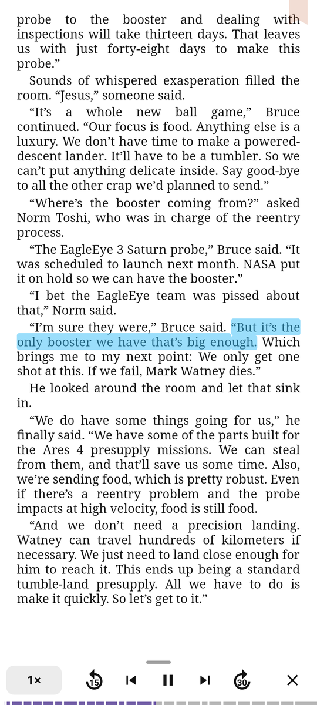<br>
      <sub><b>Readaloud</b> — synced highlight &amp; narration</sub>
    </td>
  </tr>
</table>

## Features

### Reading
- EPUB and PDF readers
- Table of Contents navigation
- Chapter navigation rail for jumping between sections
- In-book text search
- Chapter map progress indicator
- Fullscreen immersive reading mode

### Reading Display
- Rich formatting controls (themes, fonts, sizing, spacing, margins, justification)
- Auto theme that switches between configured day and night themes on a global clock schedule
- Paginated and continuous scroll modes, with landscape double-page spread
- Per-book formatting overrides
- Volume-key page navigation (with optional inverted direction)
- Keep screen on

### Highlights, Notes & Bookmarks
- Highlight passages in any color while reading
- Attach notes to highlights for personal commentary
- Bookmark pages for quick return
- Search across all highlights, notes, and bookmarks in your library
- Optional WebDAV keeps highlights, notes, and bookmarks in sync across devices — Audiobookshelf has no native annotation API, so Riffle uses a user-supplied WebDAV target instead.

### Listening
- Full audiobook player for any Audiobookshelf audiobook, streamed directly from your server — including audiobook-only items with no paired ebook
- Transport controls: play/pause, skip 15s back / 30s forward, and previous/next chapter
- Seekable chapter-map scrubber with chapter ticks, plus per-chapter and whole-book remaining time
- Variable playback speed (0.5×–3.0×) with quick presets, remembered per book
- Background playback with lock-screen, notification, and Bluetooth media controls
- Download audiobooks for offline listening, with progress that reconciles when you reconnect
- Storyteller **Readaloud** in the reader: synced sentence highlight, auto-page-turn, "Play from here," and background playback
- Listening and reading positions stay in sync for matched books — pick up in the reader exactly where you stopped listening, and vice versa

### Library
- Multi-server support with library visibility controls
- Browse by Home, To Read, Series, Collections, and All Books
- Cover grid with book details
- Read/unread and "To Read" toggles
- Full-text library search

### Downloads & Offline
- Download for offline reading, plus automatic caching on open
- Downloads manager with bulk removal
- Offline detection and seamless offline reading

### Server & Sync
- Audiobookshelf and Storyteller login with secure token storage and insecure-connection warnings
- Storyteller Readaloud Library: browse every completed readaloud as a single library
- Automatic Storyteller↔Audiobookshelf matching with a Settings review queue: high-confidence pairs auto-confirm, fuzzy matches go to Pending Review, and a manual picker pairs anything the matcher can't place
- Bidirectional progress sync with last-update-wins conflict resolution, unified across the ebook, audiobook, and readaloud of a matched book
- Periodic auto-sync, offline queueing, and durable reconciliation of progress recorded while offline
- Reading session time tracking

## Requirements

- Android 7.0 (API 24) or higher
- A running [Audiobookshelf](https://www.audiobookshelf.org/) or [Storyteller](https://storyteller-platform.gitlab.io/storyteller) server

## Distribution

| Channel | Status |
|---------|--------|
| Google Play Store | Planned |
| F-Droid | Planned |
| GitHub Releases | CI-built signed APK |

## Architecture

Riffle follows a strict layered architecture designed for future Kotlin Multiplatform (KMP) migration:

```
app/                  # Android UI — Jetpack Compose + Hilt
core/domain/          # Pure Kotlin — entities, repository interfaces, domain logic
core/network/         # Pure Kotlin — OkHttp-based ABS API client
core/database/        # Android — Room database
core/data/            # Android — repository implementations, Keystore token storage
```

## Development

### Prerequisites

- Android SDK (via Android Studio or `sdkmanager`)

### Bootstrap

```sh
make bootstrap   # Install JDK 17, download Gradle wrapper, fetch bundled fonts
```

### Build

```sh
make build       # Assemble debug APK
make test        # Run unit tests
make check       # Full CI check: build + lint + tests
make install     # Build and install debug APK on connected device
```

## Glossary

See [`CONTEXT.md`](CONTEXT.md) for the full domain glossary (Server, Library, Library Item, Cache, Download, Reading Session, Progress Sync, etc.).
